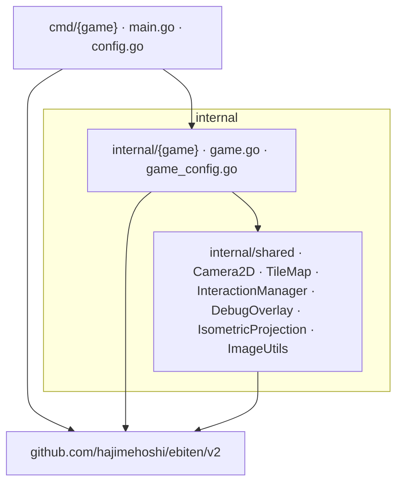

# ebitengine-core

The goal of this repository is to provide a "core" minimal ebitengine project ready for use.

## Getting Started

1. Open in devcontainer (Docker required)
2. Build and run an example:
   ```bash
   cd cmd/helloworld
   make build
   ./helloworld
   ```

## Examples

- **helloworld** - Minimal example displaying "Hello, World!"
- **example_ui** - Interactive UI with buttons, checkboxes, and text boxes
- **tiles** - Tilemap rendering demo with layered tiles and debug overlay
- **font** - Text rendering demo with custom fonts and Japanese Kanji
- **isometric** - Isometric world viewer with camera pan/zoom and procedural generation
- **sprites** - High-performance sprite rendering with optional goroutine parallelization
- **animation** - Sprite animation demo using frame-based sprite sheets
- **infinite_scroll** - Infinite scrolling background demo
- **runner** - Side-scrolling runner combining animated sprites and scrolling background

## Project Structure

```
cmd/                    # Executable entry points
  ├── helloworld/       # Basic demo
  ├── example_ui/       # UI widgets demo
  ├── tiles/            # Tilemap demo
  ├── font/             # Font rendering demo
  ├── isometric/        # Isometric world demo
  ├── sprites/          # Sprite performance demo
  ├── animation/        # Sprite animation demo
  ├── infinite_scroll/  # Infinite scrolling background demo
  └── runner/           # Side-scrolling runner demo
internal/               # Reusable components
  ├── helloworld/       # Hello world logic
  ├── shared/           # Shared utilities (Camera2D, IsometricProjection, InteractionManager, etc.)
  ├── example_ui/       # Example UI game + widgets (Button, CheckBox, TextBox)
  ├── tiles/            # Tiles game implementation
  ├── font/             # Font demo implementation
  ├── isometric/        # Isometric game implementation
  ├── sprites/          # Sprites game implementation
  ├── animation/        # Sprite animation implementation
  ├── infinite_scroll/  # Infinite scroll implementation
  └── runner/           # Runner game implementation
```

## Architecture



**Package Structure:**
- `cmd/` - Thin entry points that configure and run games
- `internal/shared/` - Cross-game utilities (InteractionManager, DebugOverlay, TileMap, image utilities)
- `internal/{game_name}/` - Game-specific logic and widgets (one package per game)

**Interface Pattern:**
Each game implements `ebiten.Game` interface implicitly (Go's duck typing):
- `Update() error` - Game logic per frame
- `Draw(screen *ebiten.Image)` - Rendering per frame
- `Layout(w, h int) (int, int)` - Screen dimensions

**Separation of Concerns:**
- Shared utilities in `internal/shared/` are truly reusable across games
- Game-specific widgets stay with their games (e.g., Button/CheckBox in `internal/example_ui/`)
- Game structs own their state and widget instances
- Main functions handle window setup and game initialization

## AI Assistant Reference

> This section helps AI assistants efficiently navigate the codebase by providing direct file paths and their purposes, minimizing token usage from exploratory file reads.

**Guidelines for AI Assistants:**
- **Prioritize shared components:** Always check `internal/shared/` for existing utilities before implementing new functionality
- **Propose extensions:** If shared components could be extended to support new use cases, ask the user for their opinion before implementing
- **Consider both functionality and readability:** Evaluate whether abstractions provide syntactic sugar that improves code clarity, not just raw functionality

**Entry Points:**
- `cmd/{game_name}/main.go` - Each game has a thin main.go that configures and runs the game

**Configuration:**
- `go.mod` - Dependencies
- `cmd/{game_name}/config.go` - Game-specific screen and configuration settings

**Core Game Logic:**
- `internal/{game_name}/game.go` - Game loop implementation (Update/Draw/Layout)
- `internal/{game_name}/game_config.go` - Game configuration struct

**Shared Components:**
- `internal/shared/camera.go` - Camera2D for pan/zoom with smooth interpolation
- `internal/shared/isometric.go` - IsometricProjection for coordinate conversion
- `internal/shared/interaction.go` - InteractionManager for rectangular click detection
- `internal/shared/debug_overlay.go` - TPS/FPS debug display widget
- `internal/shared/tilemap.go` - TileMap component for layered tile rendering
- `internal/shared/image_utils.go` - Image loading and Spritesheet utilities
- `internal/shared/isometric.go` - IsometricProjection for coordinate conversion
